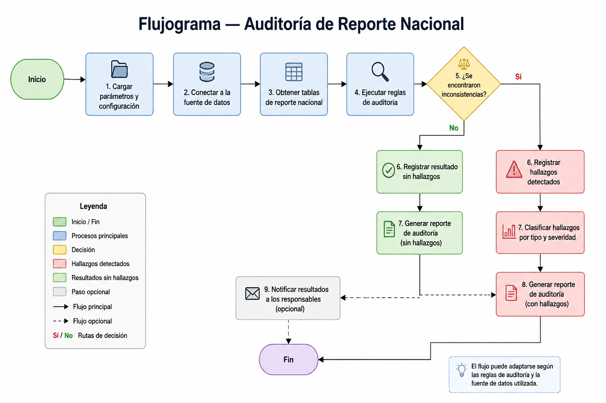

# 🗂️ Auditoría de Reporte Nacional — MSE&V

> Aplicación de escritorio en Python para auditar tablas de reporte nacional de programas y proyectos. Detecta errores, inconsistencias y duplicados, mejorando la calidad de los datos y agilizando la revisión del equipo.

---

## 🎯 Objetivo

- ✅ Validar que los reportes cumplan con los estándares de calidad.
- 🔍 Detectar duplicados por ID o documento.
- ⚖️ Comprobar coherencia entre sexo/género y edad.
- 📊 Generar un resumen de errores y exportar resultados en Excel.

---

## 🛠️ Requisitos

- Python 3.8 o superior
- Librerías externas:
  - `pandas`
  - `openpyxl`
- `tkinter` *(incluido en la instalación estándar de Python)*

### Instalación

```bash
pip install pandas openpyxl
```

---

## 🚀 Uso

**1. Clona el repositorio:**

```bash
git clone https://github.com/karolnathalyrg-blip/auditoria-reporte-nacional.git
cd auditoria-reporte-nacional
```

**2. Ejecuta la aplicación:**

```bash
python auditoria_reporte_nacional.py
```

**3. Dentro de la app:**

1. Carga tu archivo Excel desde la interfaz gráfica.
2. Haz clic en **Analizar** para detectar errores.
3. Exporta los resultados a Excel con hojas separadas:

| Hoja | Contenido |
|---|---|
| `Resumen` | Cantidad de errores por tipo |
| `Detalle de errores` | Listado completo de inconsistencias |
| `Incoherencias críticas` | Errores graves que requieren revisión inmediata |
| `Homologación de columnas` | Mapeo de columnas detectadas |

---

## 🔄 Flujograma del proceso



---

## 📁 Estructura del repositorio

```
auditoria-reporte-nacional/
│
├── auditoria_reporte_nacional.py   # Aplicación principal
├── examples/                       # Archivos de entrada y salida de ejemplo
├── docs/
│   ├── flujo_proceso.png           # Flujograma del proceso
│   └── screenshots/                # Capturas de pantalla de la app
└── README.md
```

---

## 👩‍💻 Autora

**Karol Nathaly Romero González**  
Profesional en Monitoreo, Seguimiento, Evaluación y Análisis de Datos | Especialista en Big Data

[](https://www.linkedin.com/in/TU-USUARIO-AQUI)
